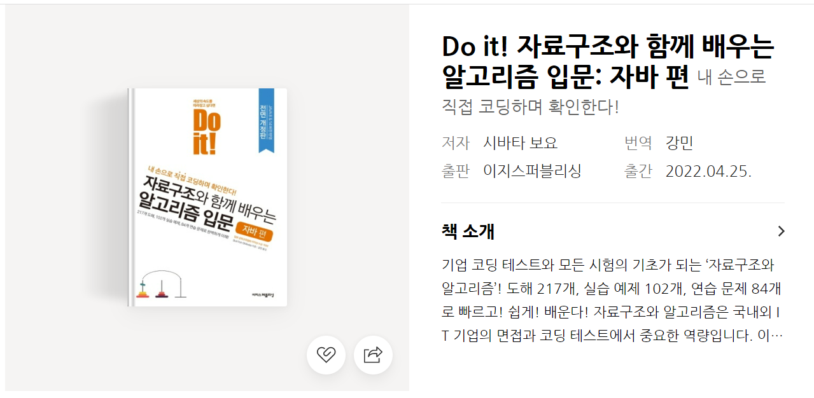

[baekjoon 알고리즘](https://github.com/hyunnn0105/algorithm_basic/tree/master/src/Baekjoon)

### 참고한 책
## chap01 - 기본 알고리즘   
    01-1. 알고리즘이란?
    01-2. 반족  
## chap02 - 기본 자료구조   
    02-1. 배열이란?
    02-2. 클래스란?
## chap03 - 검색 알고리즘
    03-1. 검색 알고리즘이란?
    03-2. 선형 검색
    03-3. 이진 검색
## chap04 - 스택과 큐
    04-1. 스택이란?
    04-2. 큐란?
## chap05 - 재귀 알고리즘
    05-1. 재귀 알고리즘의 기본
    05-2. 재귀 알고리즘 분석
    05-3. 하노이의 탑
    05-4. 8퀸 문제
